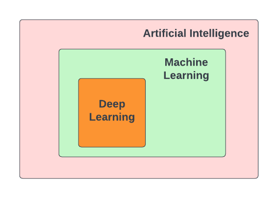
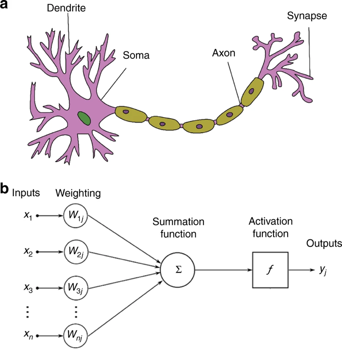
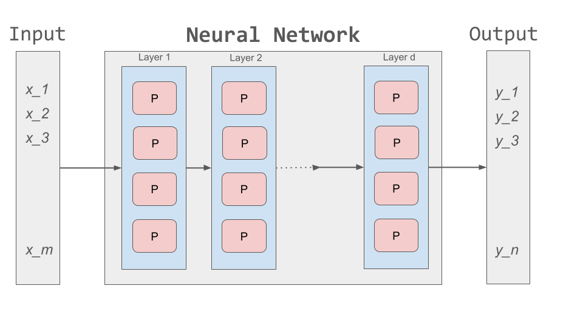
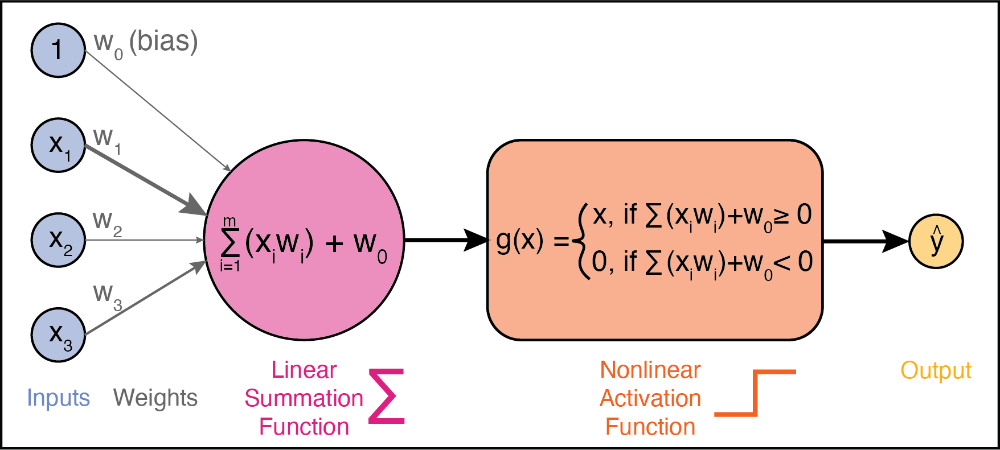
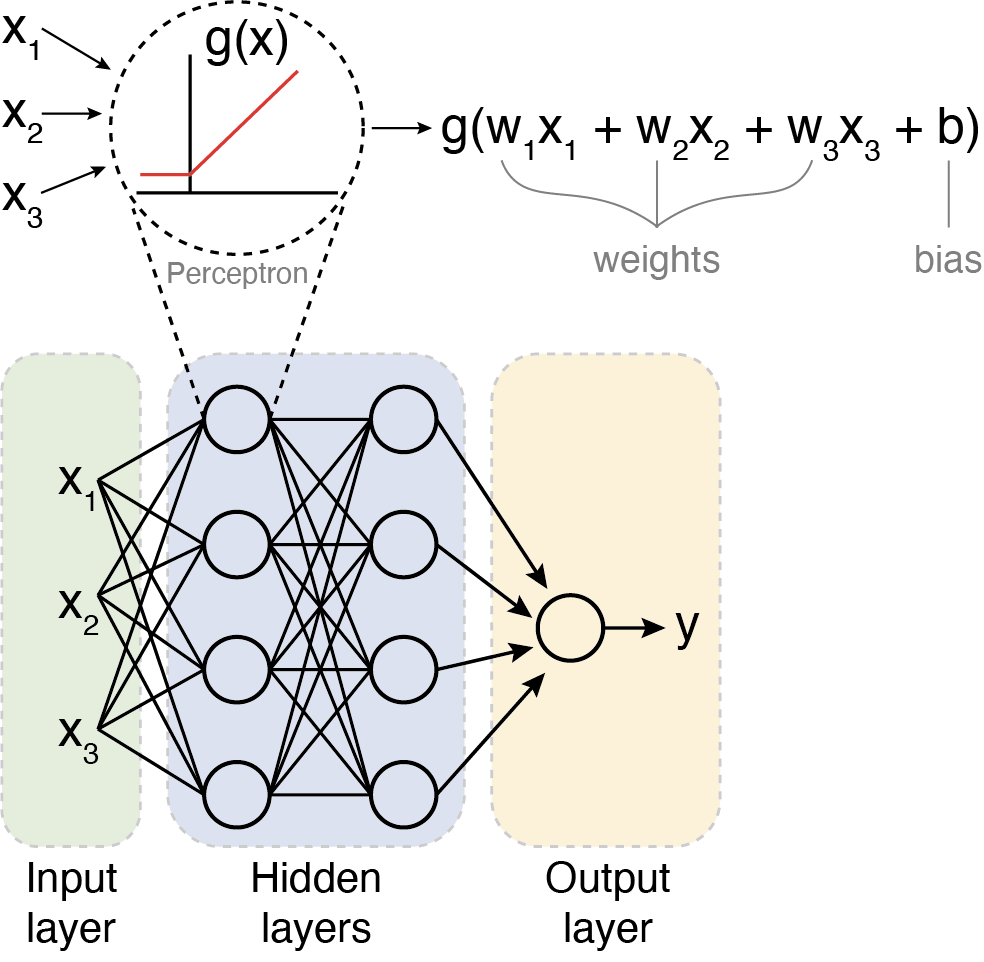

Introduction to Deep Learning
=============

Deep Learning has achieved remarkable progress in recent years, revolutionizing fields ranging
from image classification to natural language processing. **Deep Learning** is a subfield of 
Machine Learning, which itself falls under the broader category of **Artificial Intelligence (AI)**. 

Interest in Deep Learning has grown substantially in recent years due to rapid advances in the
architectures and training of **Artifical Neural Networks (ANNs)**. These networks, inspired by the
structure and behavior of neurons in the brain, were originally proposed in 1943 to help researchers 
understand brain function [1]_.
Today, they serve as powerful tools for learning from data and solving complex problems. 

    Biological neuron (a) vs. artificial neuron (b). Source: Zhang et al. 2019 [2]_

Some examples of how Deep Learning is being used in life sciences research are:
    1. `Predicting the 3D structure of proteins from their amino acid sequences <https://doi.org/10.1038/s41586-021-03819-2>`_
    2. `Predicting the intestinal absorption of chemical compounds on the basis of peptide sequence <https://doi.org/10.1186/1471-2105-8-245>`_
    3. `Automated species recognition from image, video, and sound data <https://doi.org/10.1111/2041-210X.13075>`_ 
    4. `Translating the raw signal of long-read Oxford Nanopore sequencers into nucleotide calls <https://doi.org/10.1186/s13059-019-1727-y>`_ 
    5. `Estimating population genetic variables such as mutation rates, population sizes, and recombination rates <https://doi.org/10.1093/molbev/msy224>`_
    6.  `Predicting sample origins based on genetic variation <https://doi.org/10.7554/eLife.54507>`_

The range of applications is extensive, and each of these examples incorporates deep learning in some way. 

**Why do we care about Deep Learning?**

Fields such as biology, chemistry, and medicine are becoming increasingly data-intensive. With recent advacements in technologies such as 
next-generation sequencing, high-throughput screening, and medical imaging, massive volumes of data are being generated every day.
This has ushered in an era of "*big data*", presenting exciting new opportunities as well as significant challenges.
Extracting meaningful patterns, also known as features, from these complex datasets by hand is extremely time-consuming, non-scalable, and 
heavily reliant on domain expertise. 

By leveraging **Artifical Neural Networks (ANNs)**, Deep Learning delegates this responsibility of feature extraction and prediction to computers. 
Let's start by understanding the principles of ANNs.

=============
Artifical Neural Networks (ANNs)
=============
Artifical Neural Networks, or just *neural networks* for short, have been around for several decades.
However, recently there has been a significant uptick in the number of applications that make use of neural networks. 
Let's talk about some of the factors that have contributed to the increase in use of neural networks in recent years:

1. Access to machines with **GPUs** (Graphical Processing Units) to run compute-intensive Deep Learning algorithms:
  * DL tasks involve high dimensional data such as audio, text, and images. Processing and analyzing this data needs intensive mathematical computations (matrix multiplications), which can be efficiently done on GPUs.
  * Training DL models that have millions or billions of trainable parameters (weights and biases) is faster on GPU versus CPU.
2. Availability of advanced machine learning frameworks such as `TensorFlow <https://www.tensorflow.org/>`_.
  * ``TensorFlow`` is an **open-source** machine learning framework developed by Google.
  * It provides an ecosystem of tools, libraries, and resources for building and deploying DL models
  * ``TensorFlow`` is optimized for performance on GPU and TPU (Tensor Processing Unit – AI accelerator developed by Google for running workloads based off of ``TensorFlow``)
  * With ``TensorFlow`` we can build a wide range of ANNs – from simple, feedforward NNs to complex DL architectures.
3. Lastly, the growing availability of datasets has enabled effective DL model training. For example, the `Protein Data Bank (PDB) <https://www.wwpdb.org/>`_ contains over 200,000 experimentally-determined protein structures, which were used to train AlphaFold2 [3]_, winner of the 2024 Nobel Prize in Chemistry.

**Basic Idea**

Neural networks are mathematical systems that can learn patterns from data and model real-world processes.
In this sense, a neural network is just another kind of machine learning model like the ones we have already studied.

The basic architecture of a neural network is depicted below:

=============
Perceptrons
=============
A **perceptron**, analogous to a single neuron, is the basic building block of a neural network.
Broadly speaking, a perceptron is a mathematical function that takes in any number of inputs and produces a single output.
The basic architecture of a perceptron is depicted below:

Inputs and Weights
--------------
A perceptron has multiple inputs, which we'll call :math:`x_1`, :math:`x_2`, and :math:`x_3`.
Each input has an associated **weight**, denoted as :math:`w_1`, :math:`w_2`, and :math:`w_3`.
These weights determine how important each input is to the percepton's decision.
During *training*, these weights are adjusted to improve accuracy; during *testing*, they remain fixed.

Linear Summation Function
--------------
Each input is multiplied by its corresponding weight, and then all of the weighted inputs are summed together via a **linear summation function**: 

    .. math:: Sum = (w_1x_1) + (w_2x_2) + (w_3x_3) + w_0
A **bias** term, :math:`w_0`, is also added to the linear combination.
The bias is like the intercept in a linear equation–it allows the perceptron to make predictions even when all inputs are zero.
Together, the weights and bias (:math:`w_0, w_1, w_2,...`) are called the **parameters** of the perceptron.

Nonlinear Activation function
--------------
The weighted sum (including the bias) is then passed through a **nonlinear activation function** to produce the perceptron's output.
One common activation function is the **ReLU (Rectified Linear Unit)** function, which is defined as:
  .. math:: ReLu(x) = max(0, x)
  * If the sum is positive, we keep it as is. 
  * If the sum is negative (or less than zero), we set it to 0. 
  * As a result, the output has a range of 0 to infinity.
Activation functions introduce **non-linearity**, allowing neural networks to learn complex patterns in data.

=============
Summary
=============
To summarize, the perceptron takes in multiple inputs (as many as you want) and assigns weights to them. 
It calculates a weighted sum of the inputs, adds a bias term, and then passes the result through an activation function to produce an output.
When multiple perceptrons are connected, they form a neural network that can learn complex decision boundaries.

    Multilayer perceptron. Adapted from: Beardall et al. 2022 [4]_

**Reference List**
 * The material in this module is based on `COE 379L: Software Design for Responsible Intelligent Systems <https://coe-379l-sp24.readthedocs.io/en/latest/unit03/neural_networks.html>`_
.. [1] McCulloch, W.S., Pitts, W. A logical calculus of the ideas immanent in nervous activity. Bulletin of Mathematical Biophysics 5, 115–133 (1943). https://doi.org/10.1007/BF02478259
.. [2] Zhang, Q., Yu, H., Barbiero, M. et al. Artificial neural networks enabled by nanophotonics. Light Sci Appl 8, 42 (2019). https://doi.org/10.1038/s41377-019-0151-0
.. [3] Jumper, J., Evans, R., Pritzel, A. et al. Highly accurate protein structure prediction with AlphaFold. Nature 596, 583–589 (2021). https://doi.org/10.1038/s41586-021-03819-2
.. [4] Beardall, William A.V., Guy-Bart Stan, and Mary J. Dunlop. Deep Learning Concepts and Applications for Synthetic Biology. GEN Biotechnology 1, 360–71 (2022). https://doi.org/10.1089/genbio.2022.0017.
