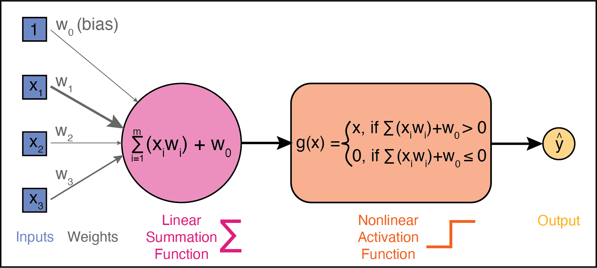
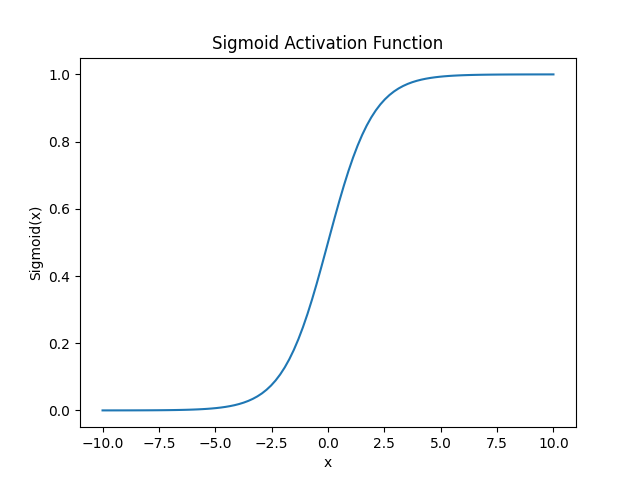

Intro to Deep Learning
=============

Deep learning has revolutionized the way computers learn and process information. 
It has become one of the most powerful tools for complex data analysis and automated decision-making.
As a subfield of **artificial intelligence (AI)** and **machine learning (ML)**, deep learning uses **artificial neural networks (ANNs)** to extract patterns and insights from large amounts of data autonomously. 

.. image:: ./images/AI-ML-DL.png
    :alt: AI-ML-DL Diagram
    :width: 500px
    :align: center

Artificial neural networks (ANNs) have been around for several decades, but recent advances in ANN architecture and training methods have driven a surge in their popularity and applications. 
This progress is fueled by:

* **Computing Power**: The accessibility of GPUs and TPUs (Tensor Processing Units) has accelerated the training process, enabling efficient processing of high-dimensional data as well as the development of models with millions (or billions) of parameters.
* **Development of DL Frameworks**: Tools like `TensorFlow <https://www.tensorflow.org/>`_ and `PyTorch <https://pytorch.org/>`_ have made it easier to build and train neural networks and are optimized for GPU and TPU performance.
* **Big Data**: Expanding datasets, such as the `Protein Data Bank (PDB) <https://www.wwpdb.org/>`_ (containing >200,000 protein structures), have enabled the training of larger and more complex models, such as AlphaFold2 [1]_, whose creators were awarded the 2024 Nobel Prize in Chemistry.

Originally proposed in 1943 to help researchers understand brain function [2]_, ANNs now serve as powerful tools for learning from data and solving complex problems.

**Deep Learning in Life Sciences**

Deep learning is driving breakthroughs in life sciences research, including:

    1. `Predicting the 3D structure of proteins from their amino acid sequences <https://doi.org/10.1038/s41586-021-03819-2>`_
    2. `Automated species recognition from image, video, and sound data <https://doi.org/10.1111/2041-210X.13075>`_ 
    3. `Translating the raw signal of long-read Oxford Nanopore sequencers into nucleotide calls <https://doi.org/10.1186/s13059-019-1727-y>`_ 
    4.  `Predicting sample origins based on genetic variation <https://doi.org/10.7554/eLife.54507>`_

The range of deep learning applications is extensive, making it an exciting field for researchers to explore. 

=============
Understanding Neural Networks
=============

Artificial Neural Networks, or just *neural networks* for short, are the backbone of deep learning.
They consist of artificial neurons called **perceptrons**, which process information in a way inspired by biological neurons in the human brain.

In biological neurons, the dendrite receives electrical signals from other neurons and only fires an output signal when the total input signals exceed a certain threshold.
Similarly, perceptrons take in multiple inputs, apply weights to them to signal their importance, and produce a single output that represents the total strength of the input signals. 

.. figure:: ./images/Bio-Basis-of-ANNs.png
    :alt: Biological basis of Artifical Neural Networks
    :width: 500px
    :align: center

    Biological neuron (a) vs. artificial neuron (b). Source: Zhang et al. 2019 [3]_

Perceptrons: The Building Blocks of Neural Networks
--------------------------------------------------

**1. Inputs and Weights**

A perceptron has multiple inputs, which we'll call :math:`x_1`, :math:`x_2`, and :math:`x_3`.
Each input has an associated **weight**, denoted as :math:`w_1`, :math:`w_2`, and :math:`w_3`.
These weights determine how important each input is to the perceptron's decision.
During *training*, these weights are adjusted to improve accuracy; during *testing*, they remain fixed.

**2. Linear Summation Function**

Each input is multiplied by its corresponding weight, and then all of the weighted inputs are summed together via a **linear summation function**: 

    .. math:: Sum = (w_1x_1) + (w_2x_2) + (w_3x_3) + w_0
A **bias** term, :math:`w_0`, is also added to the linear combination.
The bias is like the intercept in a linear equation–it allows the perceptron to make predictions even when all inputs are zero.
Together, the weights and bias (:math:`w_0, w_1, w_2,...`) are called the **parameters** of the perceptron.

**3. Nonlinear Activation function**

The weighted sum (including the bias) is then passed through a **nonlinear activation function** to produce the perceptron's output.
Activation functions introduce **non-linearity**, allowing neural networks to learn complex patterns in data.

The basic architecture of a perceptron is depicted below:

Activation Functions
---------------------

Below are some of the most common activation functions used in deep learning.

The `sigmoid` Activation Function
++++++++++++++++++++++++++++++++++

Mathematically, the `sigmoid` function is defined as:

.. math::
    f(x) = \frac{1}{1 + e^{-x}}

When plotted, the sigmoid function looks like this:

The output of the sigmoid function always falls between 0 and 1. As ``x`` becomes very negative, the output approaches 0, and as ``x`` becomes very positive, the output approaches 1. Around ``x=0``, the function is at its steepest—this is where the function is most sensitive to changes in ``x``. These properties make the sigmoid function useful for **binary classification** problems, where we want to model probabilities between 0 and 1. 

The `softmax` Activation Function
++++++++++++++++++++++++++++++++++

The `softmax` function is often used in the output layer of neural networks for **multi-class classification** tasks.
It converts raw output scores (called *logits*) into probabilities that sum to 1.

Mathematically, for an input vector :math:`z`, the `softmax` of element :math:`i` is defined as:

.. math:: \text{softmax}(z_i) = \frac{e^{z_i}}{\sum_{j} e^{z_j}}

When plotted, the `softmax` function shows how it distributes probability across multiple classes:

.. figure:: ./images/softmax-function.png
    :align: center
    :width: 700px

Softmax converts raw scores (logits) into a probability distribution. When input values differ slightly (left), probabilities are distributed more evenly. When differences are amplified (right), the highest value dominates the distribution, showing how softmax helps neural networks make confident predictions.

**Thought Challenge:** Why might `softmax` be better than using `sigmoid` when we have multiple classes?

.. toggle:: Click to show the answer

    `softmax` is better than `sigmoid` for multi-class problems because it looks at all the output perceptrons together, rather than independently, and **forces the model to choose the most likely class**. 

    For example, imagine you are building a model to classify a cancer sample into one of three cancer types. You wouldn't want the model to say: "It's 90% likely to be a sarcoma, 70% likely to be a carcinoma, and 50% likely to be a lymphoma."
    That is confusing–and not very useful!

    Instead, with `softmax`, the model would say: "Given all the evidence, I'm 95% confident that this is a sarcoma, 5% that it's a carcinoma, and 0% that it's a lymphoma."

The `ReLU` (Rectified Linear Unit) Activation Function
+++++++++++++++++++++++++++++++++++++++++++++++++++++++

The `ReLU` function is the most popular activation function in deep learning.
It is used in almost all Convolutional Neural Networks (CNNs), which we will talk about later in the course.

Mathematically, the `ReLU` function is defined as:

.. math::
    f(x) = max(0, x)

This means that our range of output is from 0 to infinity:
`ReLU` returns the input value if it's positive, and 0 if it's negative or zero. 

.. figure:: ./images/ReLU-function.png
    :align: center
    :width: 500px

Unlike the `sigmoid` function, the `ReLU` function does not flatten out in the positive region.
`ReLU` is also computationally efficient and straightforward to implement, involving only a simple thresholding operation where negative values and zero are set to zero.

These properties make `ReLU` a popular choice for hidden layers in deep neural networks.

.. list-table:: Activation Function Comparison
   :widths: 15 20 25 25
   :header-rows: 1

   * - Function
     - Range
     - Typical Use
     - Key Advantage
   * - Sigmoid
     - 0 to 1
     - Binary classification output
     - Smooth probability output
   * - Softmax
     - Multiple values that sum to 1
     - Multi-class classification output
     - Proper probability distribution
   * - ReLU
     - 0 to infinity
     - Hidden layers
     - Computational efficiency

Network Architecture
-----------------------------------
A neural network is made up of *layers of perceptrons*, where each perceptron applies a mathematical function to its inputs and passes the result to the next layer.
These layers include:

1. **Input layer**: The first layer of the neural network, which receives raw data (e.g., an image or DNA sequence).
2. **Hidden layers**: Layers between the input and output layers, which learn complex features from the input data.
3. **Output layer**: The final layer of the neural network, which produces the final output (e.g., classification of a tumor as malignant or benign).

The basic architecture of a neural network is depicted below:

.. figure:: ./images/ann-arch-overview.png
    :alt: Basic Idea of ANN Architecture
    :width: 600px
    :align: center

Each perceptron in a layer is connected to perceptrons in the next layer, and these *connections have weights*, which determine the influence of each input.
During training, these weights are adjusted to improve accuracy. 

Putting it all together
++++++++++++++++++++++++++++
To summarize, the perceptron takes in multiple inputs (as many as you want) and assigns weights to them. 
It calculates a weighted sum of the inputs, adds a bias term, and then passes the result through an activation function to produce an output.
When multiple perceptrons are connected, they form a neural network that can learn complex decision boundaries.

    Multilayer perceptron. Adapted from: Beardall et al. 2022 [4]_

=============
Training and Inference
=============

Deep learning involves two main phases: **training** and **inference**.
Broadly speaking, *training* involves multiple iterations of feeding data into a neural network and adjusting its parameters to minimize prediction errors.
This process requires large amounts of data and computational resources to fine-tune the model for accuracy. 
Once trained, the model enters the *inference* phase, where it applies its learned knowledge to new, unseen data to make predictions. 

Training
--------------

How do we choose values for the parameters (i.e., the :math:`w_0, w_1, ..., w_n` in each perceptron) to make a neural network accurately predict an outcome?

 1. **Start with random weights**: At first, the model's predictions are guesses and likely to be inaccurate.
 2. **Compare predictions to true labels**: Since the training data is labeled, we can compare the model's predictions to the actual labels (by calculating the error).
 3. **Adjust weights using gradient descent**: The model iteratively updates its parameters to minimize the error, improving its predictions over time. 

**Gradient Descent: A Brief Refresher**

Imagine you are hiking down a mountain in thick fog. Your goal is to reach the bottom of the valley as quickly as possible.
But because of the fog, you can only see a few feet in front of you.
So, you take small steps downhill, always moving in the steepest direction based on what's directly in front of you.
This is pretty much how **gradient descent** works in machine learning. Let's quickly break it down using this image as a guide:

1. *Loss (y-axis) = The height of the mountain*: The higher you are, the worse your model is performing.
2. *Weight (x-axis) = Your position on the mountain*: Different positions on the mountain correspond to different weight values. The goal of training is to find the weight that gives the **Minimum Loss**. 
3. *Initial Weight = Your starting position on the mountain*: This is where you start hiking from (a random weight value). At this point, your model isn't very accurate (it has high loss).
4. *Gradient = The slope of the mountain at your current position*:

    * If the slope is steep, you take bigger steps (faster learning). If the slope is gentle, you take smaller steps (slower learning) to avoid overshooting the minimum.
    * If the slope is negative, you move right (increase weight). If the slope is positive, move left (decrease weight). 
5. *Minimum Loss = The bottom of the valley*: This is the point where we have reached the optimal weight value. Our model is now performing the best it can.

Gradient descent helps adjust weights, but in multi-layer networks, we need a way to distribute these adjustments across all layers. 
This process is called **backpropagation**, and it allows error signals to flow backward through the network, updating weights efficiently. 

Now that we have a basic understanding of how neural networks adjust their weights, let's look at a real-world example: training a neural network to classify gene expression profiles as malignant or benign.

**Training Example: Classifying Malignant vs Benign Tumors from Gene Expression**

Imagine you are training a neural network to classify tumors as either malignant or benign based on its gene expression profile. 

 * Each tumor sample is represented as a long vector of gene expression values–one value per gene.
 * Each input perceptron receives the expression level of a single gene. So, if your dataset includes 20,000 genes, the input layer will contain 20,000 perceptrons. Each one processes the expression level of a single gene. 
 * Hidden layers learn to detect complex, nonlinear patterns by combining gene-level signals into higher-level features.
 * The final layer produces a prediction: *malignant* or *benign*

.. figure:: ./images/training-cancer-classifier-gene.png
    :alt: A neural network in the training stage
    :width: 700px
    :align: center    

The network processes each gene expression profile through all layers and generates a prediction.
If it gets the prediction wrong, an error signal is sent backward (**backpropagation**), and the weights are adjusted accordingly using gradient descent.
This process continues across many training samples until the model learns a set of weights that minimizes prediction error.

Once training is complete, the model no longer updates its weights–it is ready to apply what it has learned to new, unseen data.
This is where *inference* comes in. 

Inference
--------------

Inference is the process of using a trained neural network to make predictions on new, unseen data. 
During inference, the model does not update its weights — it simply applies the learned weights to the new data to generate a prediction.

In our example, each new tumor sample is represented as a vector of gene expression values.
This vector is fed into the trained network, which processes it through all layers using the learned weights and biases. 

The network then produces a predicted classification: whether the gene expression profile indicates a *malignant* or *benign* tumor. 

This is the stage where the neural network becomes practically useful: once trained, it can analyze and interpret new biological data to support tasks like diagnosis, prognosis, or treatment decision-making.

======================================
Introduction to TensorFlow and Keras
======================================

TensorFlow
----------

.. image:: ./images/TensorFlow-Icon.png
    :width: 150px
    :align: right

`TensorFlow <https://www.tensorflow.org/>`_ is one of the most powerful open-source machine learning libraries available today. 
Developed by Google, TensorFlow offers a wide range of tools and resources to help you build, train, and deploy neural networks, making it accessible to both beginners and experts.

At its core, TensorFlow uses multi-dimensional arrays called *tensors* to represent data:

.. list-table:: 

    * - **Tensor Type**
      - **Example**
      - **Shape**
    * - **Scalar (Rank-0)**
      - ``5``
      - ``()``
    * - **Vector (Rank-1)**
      - ``[1, 2, 3]``
      - ``(3,)``
    * - **Matrix (Rank-2)**
      - ``[[1, 2, 3], [4, 5, 6]]``
      - ``(2, 3)``

With TensorFlow, tensors are used to represent:

 * Input data (e.g., images, text, audio, etc.)
 * Weights (parameters the model learns)
 * Outputs (predictions from the model)

Every layer in a neural network takes tensors as input, applies mathematical operations on those tensors, and produces tensors as output.

Keras
-----

`Keras <https://www.tensorflow.org/guide/keras>`_ is the high-level API of the TensorFlow platform. 
It provides a simple and intuitive way to define neural network architectures, and it's designed to be easy to use and understand.

Keras simplifies every step of the machine learning workflow, including data preprocessing, model building, training, and deployment.
Unless you're developing custom tools on top of TensorFlow, you should use Keras as your default API for deep learning tasks. 

**Core Concepts: Models and Layers**

Keras is built around two key concepts: ``Layers`` and ``Models``. 

**1. Layers**

The ``tf.keras.layers.Layer`` class is the fundamental abstraction in Keras.
A ``Layer`` is a building block of a neural network. It takes input tensors, applies some transformation, and produces output tensors.
Weights created by layers can be trainable or non-trainable. 
You can also use layers to handle data preprocessing tasks like normalization and text vectorization. 

**2. Models**

A ``Model`` is an object that groups layers together and that can be trained on data.
There are three types of models in Keras:

 * **Sequential Model**: The simplest type of model, where layers are stacked linearly (one after another). 
 * **Functional API**: Allows for more complex model architectures, including multi-input and multi-output models. 
 * **Model Subclassing**: Provides full flexibility for custom model development by subclassing the ``tf.keras.Model`` class. 

The code example demonstrates the simplicity of building neural networks with Keras:

.. code-block:: python3

    from keras.layers import Input, Dense
    from keras.models import Sequential

    model = Sequential([                   
        Input(shape=(28,)),              # Input layer expecting 28 features (as a Rank-1 tensor)
        Dense(64, activation='relu'),    # First hidden layer with 64 neurons and ReLU activation
        Dense(32, activation='relu'),    # Second hidden layer with 32 neurons and ReLU activation
        Dense(2, activation='sigmoid')   # Output layer for binary classification
    ])

With just these few lines, we've created a complete sequential neural network with two hidden layers and an output layer that can classify data into two categories. 

In the next session, we'll apply these concepts hands-on by building our own neural network from scratch.

**Reference List**
 * The material in this module is based on `COE 379L: Software Design for Responsible Intelligent Systems <https://coe-379l-sp24.readthedocs.io/en/latest/unit03/neural_networks.html>`_
.. [1] Jumper, J., Evans, R., Pritzel, A. et al. Highly accurate protein structure prediction with AlphaFold. Nature 596, 583–589 (2021). https://doi.org/10.1038/s41586-021-03819-2
.. [2] McCulloch, W.S., Pitts, W. A logical calculus of the ideas immanent in nervous activity. Bulletin of Mathematical Biophysics 5, 115–133 (1943). https://doi.org/10.1007/BF02478259
.. [3] Zhang, Q., Yu, H., Barbiero, M. et al. Artificial neural networks enabled by nanophotonics. Light Sci Appl 8, 42 (2019). https://doi.org/10.1038/s41377-019-0151-0
.. [4] Beardall, William A.V., Guy-Bart Stan, and Mary J. Dunlop. Deep Learning Concepts and Applications for Synthetic Biology. GEN Biotechnology 1, 360–71 (2022). https://doi.org/10.1089/genbio.2022.0017.
.. [5] Keras Documentation: Model fit. https://www.tensorflow.org/api_docs/python/tf/keras/Model#fit