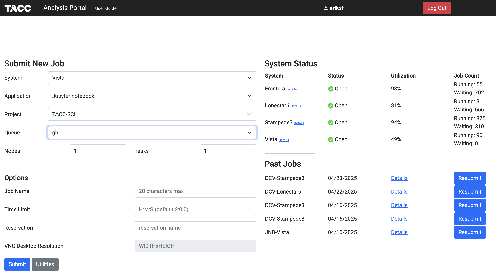
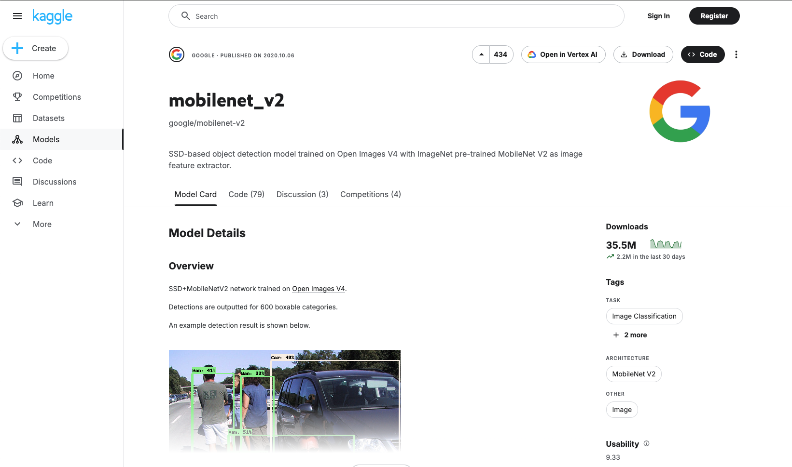
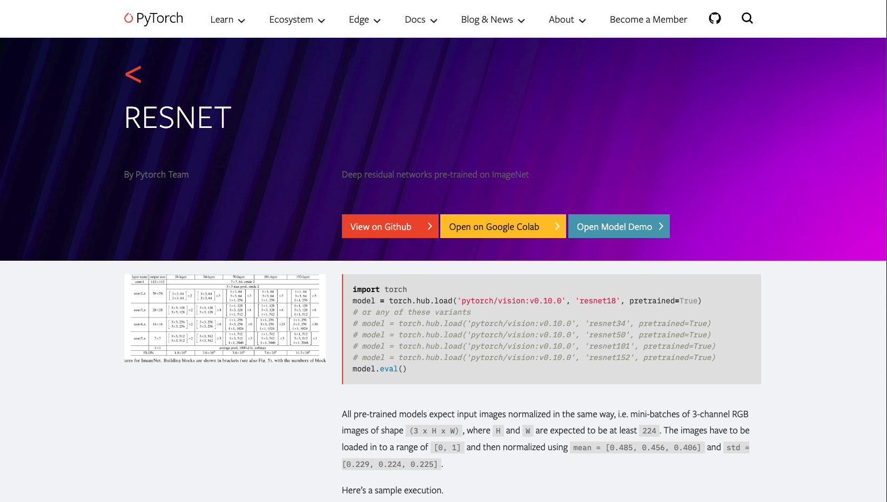

Finding and Running Models
==========================

In this section, we will explore how to find and run pre-trained models for inference using sites like
`PyTorch Hub <https://pytorch.org/hub/>`_ and `Tensorflow Hub <https://www.tensorflow.org/hub>`_. We will
also discuss how to use the `transformers` library to load models from `Hugging Face <https://huggingface.co/>`_.
After completing this section, you will be able to:

- Find and load pre-trained models from PyTorch Hub and Tensorflow Hub.
- Use the `transformers` library to load and run models from Hugging Face.

Setup
-----

To run the code examples in this section, you will need to open a `Jupyter Notebook <https://jupyter.org/>`_ on
the `TACC Analysis Portal <https://tap.tacc.utexas.edu/>`_ using the Vista compute cluster.

   TACC Analysis Portal.

Tensorflow Hub
--------------

Tensorflow Hub is a library for publishing, discovering, and consuming reusable parts of machine learning
models that is open to community contributors. It provides a collection of pre-trained models that can be easily
integrated into Tensorflow applications. To use Tensorflow Hub, you need to install the library. You can do this
using pip:

.. code-block:: console

    $ pip install tensorflow-hub 

We're going to use the `MobileNet_V2 <https://www.kaggle.com/models/google/mobilenet-v2>`_ model from Tensorflow Hub. This model is a lightweight deep learning model
that is designed for mobile and embedded vision applications. It is a popular choice for image classification tasks
and is known for its speed and accuracy. The model is pre-trained on the ImageNet dataset.

   The mobilenet_v2 model card at Tensorflow Hub/Kaggle.

The model card provides information about the model, including its architecture, input and output formats,
variations, and usage examples. We're going to use the Tensorflow 2 `tf2-preview-classification` variation to do
a simple image classification task.

First, we will need to import tensorflow, tensorflow_hub, and a few other libraries needed for this task:

.. code-block:: python

    import tensorflow as tf
    import tensorflow_hub as hub
    import numpy as np
    from PIL import Image

Next, we will load the pre-trained model from Tensorflow Hub:

.. code-block:: python

    # Load the pre-trained model from Tensorflow Hub
    model_url = "https://www.kaggle.com/models/google/mobilenet-v2/TensorFlow2/tf2-preview-classification/4"
    img_shape = (224, 224)
    classifier = tf.keras.Sequential([hub.KerasLayer(model_url, input_shape=img_shape+(3,))])

Now, we can use the model to classify an image. We will load an image from a URL, preprocess it, and then
use the model to make a prediction:

.. code-block:: python

    # Download image and compute prediction
    img_url = "https://upload.wikimedia.org/wikipedia/commons/b/b0/Bengal_tiger_%28Panthera_tigris_tigris%29_female_3_crop.jpg"
    img = tf.keras.utils.get_file("image.jpg", img_url)
    img = Image.open(img).resize(img_shape)
    img = np.array(img) / 255.0
    result = classifier.predict(img[np.newaxis, ...])   

Finally, we'll map the prediction to a corresponding class label and print out the predicted class name:

.. code-block:: python

    # Map the prediction result to the corresponding class label
    labels_url = "https://storage.googleapis.com/download.tensorflow.org/data/ImageNetLabels.txt"
    predicted_class = tf.math.argmax(result[0], axis=-1)
    labels_path = tf.keras.utils.get_file("ImageNetLabels.txt", labels_url)
    imagenet_labels = np.array(open(labels_path).read().splitlines())
    predicted_class_name = imagenet_labels[predicted_class]
    print(f"Predicted class name: {predicted_class_name}")

PyTorch Hub
-----------

PyTorch Hub is a pre-trained model repository designed to facilitate research exploration. It provides a simple
and efficient way to load pre-trained models and use them for inference and fine-tuning. To use PyTorch Hub, you
need to install the library. You can do this using pip:

.. code-block:: console

    $ pip install torch torchvision

In the previous section, we built a :ref:`Transfer learning <transfer-learning-label>` example that used the
pre-trained `ResNet18 <https://pytorch.org/hub/pytorch_vision_resnet/>`_ model from PyTorch Hub as a starting point.

   The resnet model card at PyTorch Hub.

We don't need to repeat the example here, but we will show the relevant parts on how to load the model. Since this
was a computer vision problem, we were able to use the `torchvision` library to load the
pre-trained model. The `torchvision` library provides a collection of pre-trained models for computer vision
tasks, including image classification, object detection, and segmentation. To load the pre-trained ResNet18 model,
we can use the following code:

.. code-block:: python

    import torch
    from torchvision import models

    # Load the pre-trained ResNet18 model from PyTorch Hub
    model = models.resnet18(weights='IMAGENET1K_V1')

Hugging Face Transformers
-------------------------

The `transformers` library from `Hugging Face <https://huggingface.co/>`_ provides a collection of pre-trained
models for natural language processing (NLP) tasks, including text classification, named entity recognition,
and question answering as well as for other tasks such as Computer Vision, Multimodel (multiple types of data),
and Audio. The library also provides a simple and efficient way to load pre-trained models and use them for
inference and fine-tuning.  To use the `transformers` library, you need to install the library. You can do this
using pip:

.. code-block:: console

    $ pip install transformers

Brief Introduction to Transformers
~~~~~~~~~~~~~~~~~~~~~~~~~~~~~~~~~~

Transformers are a type of neural network architecture that has become the de facto standard for NLP tasks.
They are based on the self-attention mechanism, which allows the model to weigh the importance of different
words in a sentence when making predictions. This allows transformers to capture long-range dependencies and
contextual information in text data. The `transformers` library provides a collection of pre-trained models
that are based on the transformer architecture, including BERT, GPT-2, and RoBERTa. These models have been
pre-trained on large text corpora and can be fine-tuned for specific tasks with relatively small amounts of
task-specific data.

Additional Resources
--------------------

The material in this section is based on the following resources:

* `Tensorflow Hub/Kaggle <https://www.tensorflow.org/hub>`_
* `Dataiku Developer Guide Tensorflow Hub Tutorial <https://developer.dataiku.com/latest/tutorials/machine-learning/code-env-resources/tf-resources/index.html>`_
