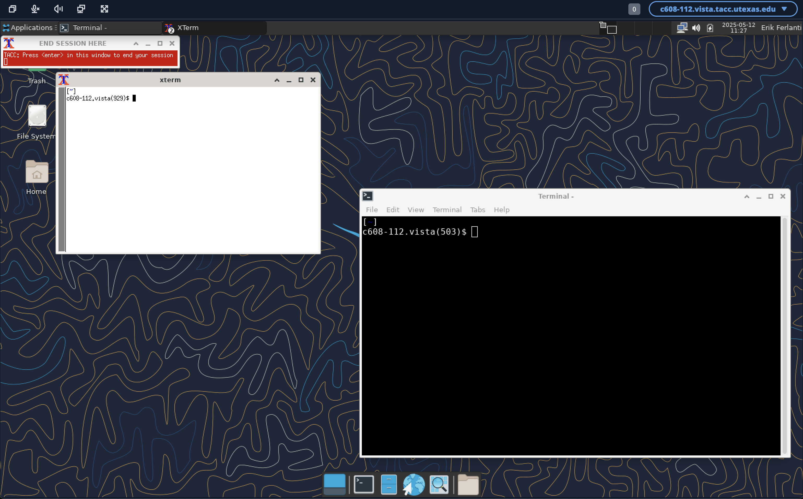
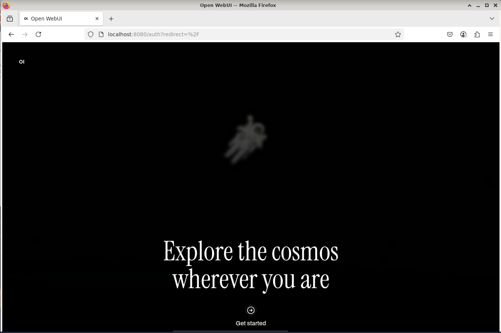
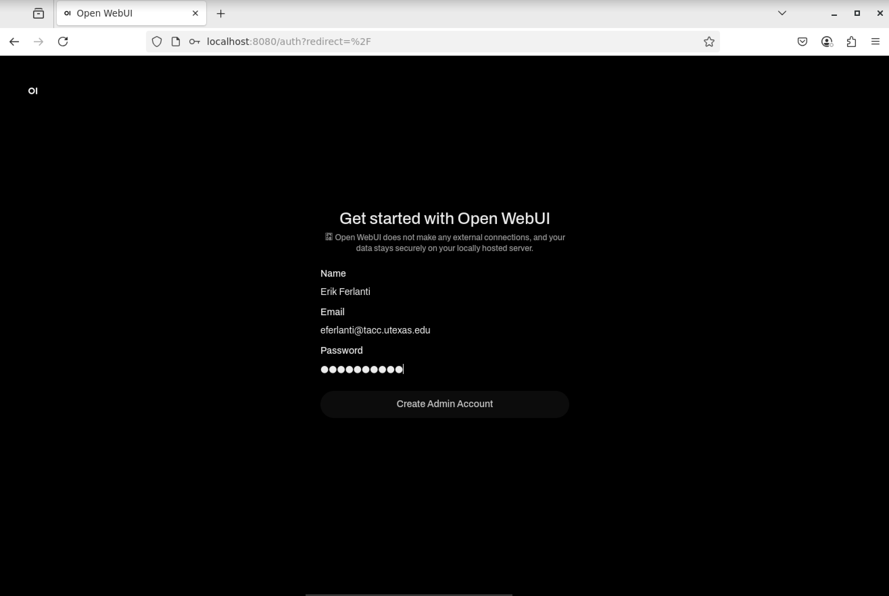
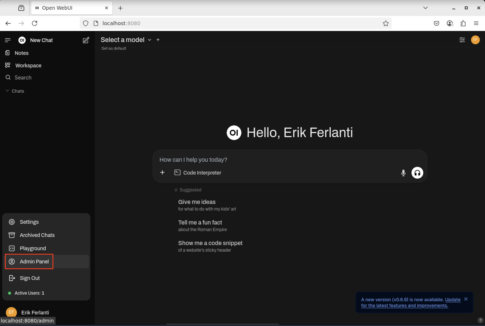
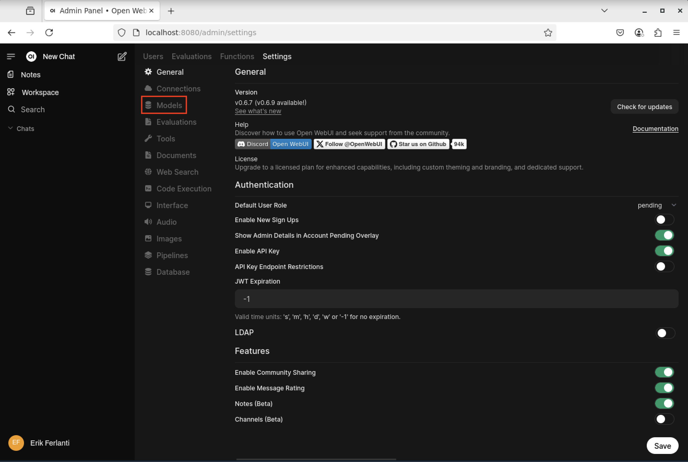
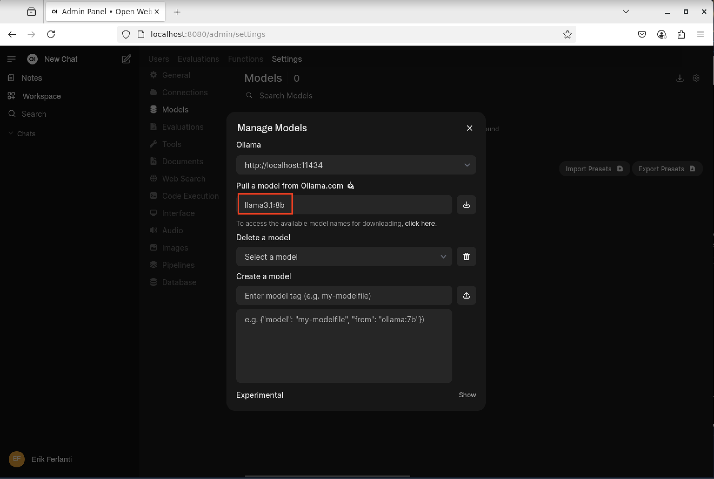
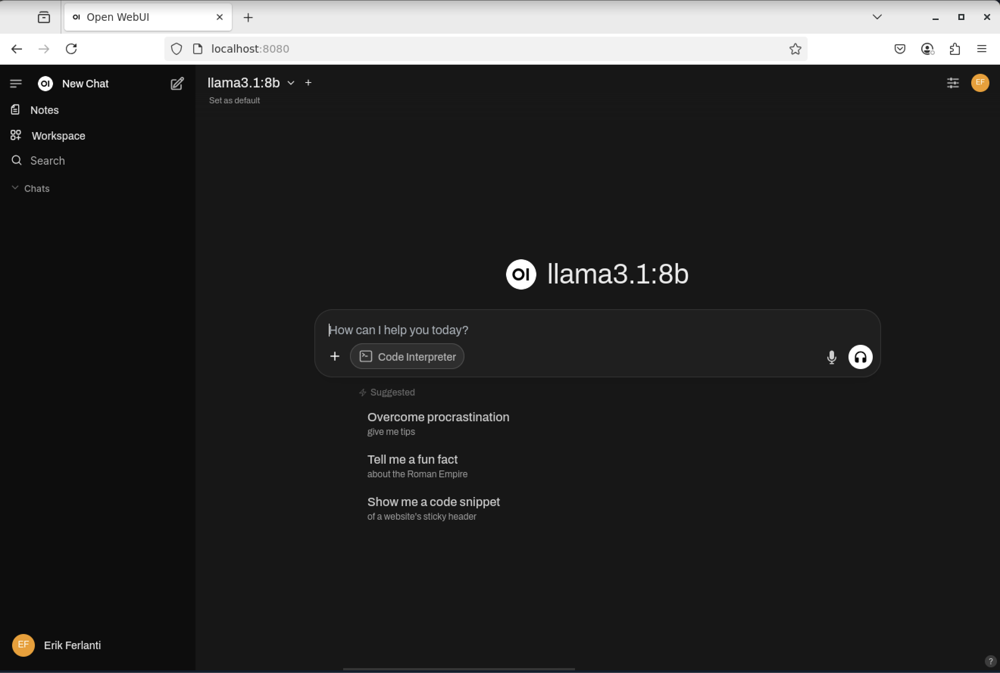

Intro to LLMs and Retrieval-Augmented Generation (RAG)
======================================================

By the end of this section, you should be able to:

* Learning Objective 1
* Learning Objective 2
* Run a chat interface to LLMs using Open WebUI and Ollama

Running a chat interface to LLMs
--------------------------------

As a demonstration, we will learn how to run a chat interface to LLMs using the open-source tools
`Open WebUI <https://github.com/open-webui/open-webui>`_  and `Ollama <https://ollama.com/>`_.
Open WebUI is a web-based interface for interacting with LLMs, while Ollama is a command-line tool for running
LLMs locally. In keeping with the theme of the previous section, we will run these tools in a container on an
HPC system.

In order to accomplish this, we will need to open a `DCV <https://docs.aws.amazon.com/dcv/latest/adminguide/what-is-dcv.html>`_
(remote desktop) session on the `TACC Analysis Portal <https://tap.tacc.utexas.edu>`_ using the Vista
compute cluster. See instructions `here </section1/tap_and_jupyter.html>`_.

   TACC Analysis Portal - DCV session.

Install a browser
~~~~~~~~~~~~~~~~~

Once working with an active DCV session, we will need to install a browser since this system does not have a browser installed by default.
We will use the open-source `Firefox <https://www.mozilla.org/en-US/firefox/new/>`_ browser.

.. code-block:: console

   # Download the Firefox install script
   $ wget https://raw.githubusercontent.com/TACC/life_sciences_ml_at_tacc/refs/heads/main/docs/section5/files/install_firefox_linux-aarch64.sh

   # Run the install script
   $ . ./install_firefox_linux-aarch64.sh
   Downloading firefox...
   Extracting firefox to /home1/03762/eriksf/bin...
   Linking /home1/03762/eriksf/bin/firefox/firefox to ff...
   Adding /home1/03762/eriksf/bin/ff to PATH...

   To permanently add '/home1/03762/eriksf/bin' to your PATH, add 'export PATH=$PATH:/home1/03762/eriksf/bin' to /home1/03762/eriksf/.bashrc

Run the Open WebUI/Ollama container
~~~~~~~~~~~~~~~~~~~~~~~~~~~~

Next, we will run the Open WebUI/Ollama container. To simplify the process, we will download and run a "start" script
that will automatically load the apptainer module, pull the container, create some data directories, and run it
with the appropriate options.

.. code-block:: console

    # Download the start script
    $ wget https://raw.githubusercontent.com/TACC/life_sciences_ml_at_tacc/refs/heads/main/docs/section5/files/start-openwebui.sh
    
    # Run the start script
    $ . ./start-openwebui.sh 

    Currently Loaded Modules:
      1) ucc/1.3.0      4) TACC            7) nvpl/25.3
      2) ucx/1.18.0     5) gcc/15.1.0      8) python3/3.11.8
      3) cmake/3.31.5   6) openmpi/5.0.5   9) tacc-apptainer/1.3.3

 

    Pulling open-webui image...
    INFO:    Converting OCI blobs to SIF format
    INFO:    Starting build...
    Copying blob 943331d8a9a9 skipped: already exists  
    Copying blob 4f4fb700ef54 skipped: already exists  
    Copying blob be2fefeabb18 skipped: already exists  
    Copying blob 394dbe96ba14 skipped: already exists  
    Copying blob fa086b39bd17 skipped: already exists  
    Copying blob 8318bf964db3 skipped: already exists  
    Copying blob 4f4fb700ef54 skipped: already exists  
    Copying blob 038636157489 skipped: already exists  
    Copying blob 0e5ecbd2fab7 skipped: already exists  
    Copying blob 441fae03f8ac done   | 
    Copying blob b6fe75420efd done   | 
    Copying blob 3b4e68a21a6d skipped: already exists  
    Copying blob e6f9fdfad974 done   | 
    Copying blob 22e9a58f5348 done   | 
    Copying blob b924c02ac309 skipped: already exists  
    Copying blob df007eea74a3 skipped: already exists  
    Copying config e72d74e30b done   | 
    Writing manifest to image destination
    2025/05/12 12:24:52  info unpack layer: sha256:943331d8a9a9863299c02e5de6cce58602a5bc3dc564315aa886fe706376f27f
    ...
    INFO:    Creating SIF file...
    Creating data directories, if needed...
    Creating secret key...
    Starting open-webui instance...
    Running start script...
    To stop open-webui, type 'apptainer instance stop openwebui1'
    $ apptainer instance list
    INSTANCE NAME    PID        IP    IMAGE
    openwebui1       1435449          /tmp/rootfs-1217685323/root

Open Web Interface
~~~~~~~~~~~~~~~~~~

Now that the Open WebUI container is running, we can access it using the Firefox browser. In the browser,
navigate to the following URL, http://localhost:8080. This will open the Open WebUI interface.

.. code-block:: console

   # Open Firefox
   $ ff &

With the browser open to the start page, click the "Get started" link at the bottom of the page.

   Open WebUI start page.

Now, fill out the form to create an admin account.

   Open WebUI admin account creation.

With the account created, we now need to load our first model. Navigate to the lower left corner of the
page and click on your name and then "Admin Panel".

   Open WebUI - Open Admin panel.

On the admin panel, select the "Settings" tab and then "Models" pane.

   Open WebUI - Admin panel - Settings.

On the Models pane, select the "Manage Models" button (downward arrow) on the far right side of the page to
open the "Manage Models" dialog box. Enter "llama3.1:8b" in the "Pull a model from Ollama.com" text box and click
the "Pull" button to the right. This will pull the Llama3.1 8 billion parameter model from Ollama.com.

   Open WebUI - Manage Models dialog box.

With the model fully downloaded and verified, close the dialog box and click the "New Chat" button in the upper
left corner of the page. This will bring us to the main chat interface and it should now show that the llama3.1:8b
model is selected.

   Open WebUI - Chat interface with llama3.1:8b selected.

Additional Resources
--------------------

